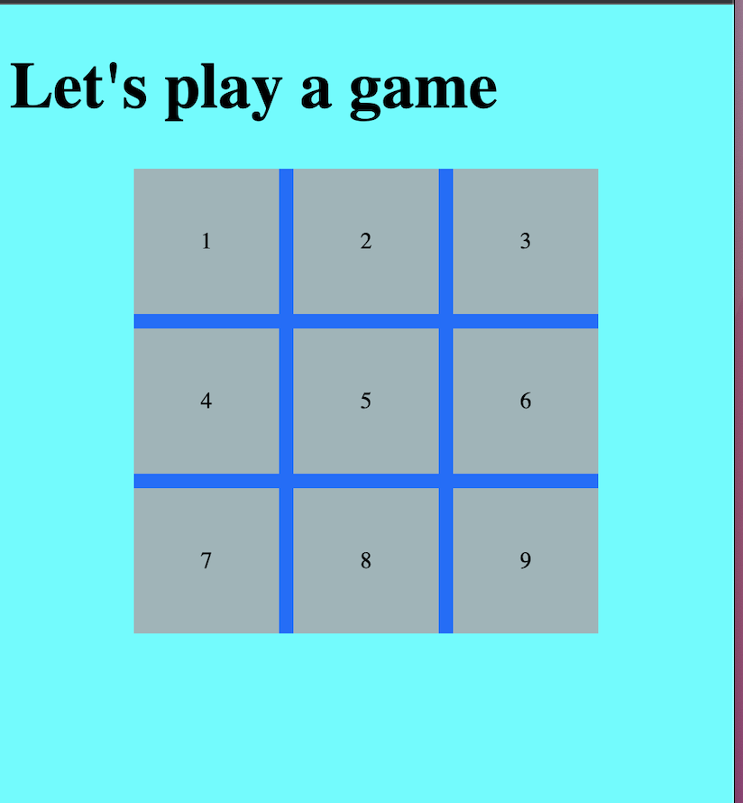
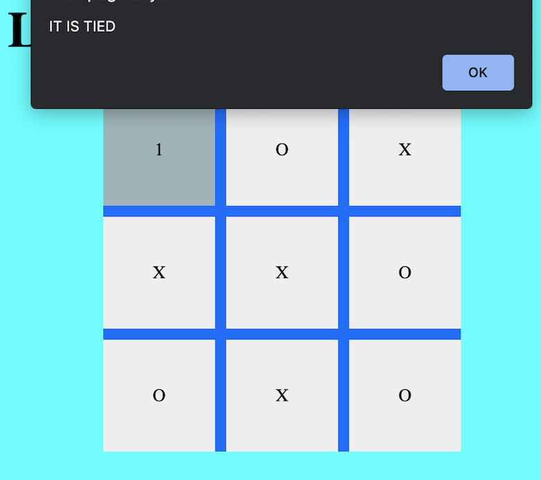

# TIC-TAC-TOE-GAME
### GAME DESCRIPTION:

Tic Tac Toe is a two-player game In this game, there is a board with 3 x 3 squares. 

The two players take turns putting marks on a 3x3 board. The goal of Tic Tac Toe game is to be one of the players to get three same symbols in a row - horizontally, vertically or diagonally on a 3 x 3 grid.  The player who first gets 3 of symbols (marks) in a row - vertically, horizontally, or diagonally wins the game, and the other loses the game.  
### GAME RULES:

1.	The player that gets to play first will get the "X" mark (we call him/her player 1) and the player that gets to play second will get the "O" mark (we call  player 2).

2.	Player 1 and 2 take turns making moves with Player 1 playing mark “X” and Player 2 playing mark “O”.

3.	A player marks any of the 3x3 squares with his mark (“X” or “O”) and their aim is to create a straight line horizontally, vertically or diagonally with two intensions: 
https://github.com/marcy-zarepour/Tic-Tac
## Feedback and issues:

We really appreciate your feedback. If you want to see some improvements in the app I'll be really grateful if you can drop me an email to marcy.zarepour@gmail.com

 

